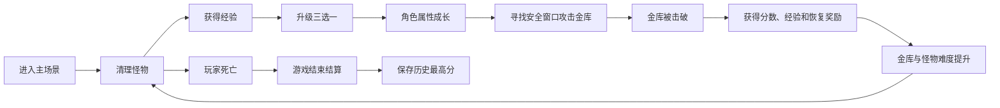
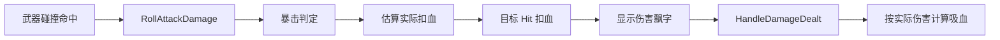
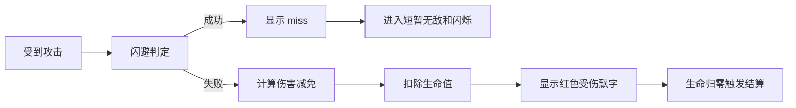

# 金库猎手

> Unity 3D 第三人称肉鸽动作游戏原型。  
> 核心体验是：清怪求生、攻击金库、随机成长、难度递增、挑战更高分数。

## 项目概述

《金库猎手》是一款个人独立开发的 Unity 3D 动作肉鸽原型。玩家在地牢场景中控制角色移动、跑步、跳跃、翻滚和三段连击，一边处理不断刷新的近战/远程怪物，一边寻找安全窗口攻击场景中的金库目标。

金库既是得分目标，也是难度推进器。玩家每次击破金库都会获得经验和恢复奖励，同时下一轮金库血量提升，场上怪物的生命、攻击和经验奖励也会随之成长。玩家需要在“先清怪保证生存”和“冒险输出金库获取收益”之间持续做决策。

本项目重点展示 Unity 客户端开发能力：角色控制、动画事件、碰撞伤害、怪物 AI、局内成长、UI 面板、运行时 UI 构建、数值配置、战斗反馈、本地最高分存储和完整单局流程。

## 当前版本

| 项目 | 内容 |
| --- | --- |
| 项目类型 | Unity 3D 单机动作肉鸽原型 |
| 开发方式 | 个人独立开发 |
| Unity 版本 | `2021.3.45f2c1` |
| 编程语言 | C# |
| 主场景 | `Assets/Scenes/MainScene.unity` |
| 核心脚本目录 | `Assets/Script` |
| 核心脚本数量 | 26 个 C# 脚本 |
| 核心代码规模 | 约 10000+ 行 C# |

说明：美术、模型、特效和 GUI 资源主要用于学习和原型展示，项目核心逻辑集中在 `Assets/Script`。

## 快速体验

1. 使用 Unity Hub 打开项目。
2. 推荐使用 Unity `2021.3.45f2c1` 或兼容的 Unity 2021 LTS 版本。
3. 打开主场景：

   ```text
   Assets/Scenes/MainScene.unity
   ```

4. 点击 Unity 编辑器顶部 Play 按钮运行。
5. 关闭开局说明弹窗后开始游戏。

## 操作说明

| 操作 | 按键 |
| --- | --- |
| 移动 | `WASD` / 方向键 |
| 跑步 | `Left Shift` / `Right Shift` |
| 跳跃 | `Space` |
| 普通攻击 / 三段连击 | 鼠标左键 |
| 翻滚 | 鼠标右键 + 移动方向 |
| 查看 / 隐藏属性面板 | `Tab` |
| 暂停 / 继续 | `Esc` |
| 关闭开局说明 | 弹窗右上角 `X` |

## 核心玩法循环



玩家在局内需要持续权衡：

- 怪物多时优先清怪，减少生存压力。
- 怪物少时攻击金库，推进分数和奖励。
- 选择攻击成长可以更快击破金库。
- 选择生命、闪避、减伤、回血、吸血可以提高容错。
- 击破金库后虽然会恢复生命，但怪物和金库也会进一步增强。

## 已实现功能

### 1. 第三人称角色控制

核心脚本：`PlayerCo.cs`、`InputCo.cs`、`CameraCo.cs`

已实现：

- 基于 `CharacterController` 的移动和碰撞。
- 基础移动、跑步、跳跃、翻滚。
- 跑步、跳跃、翻滚与 Animator 参数联动。
- 跳跃缓冲：提前按下跳跃后，落地短时间内仍可起跳。
- 土狼时间：刚离开地面的一小段时间内仍允许跳跃。
- 翻滚方向锁定：翻滚开始时记录输入方向，持续时间内按固定方向位移。
- 攻击期间限制普通移动，避免动作表现和位移逻辑互相冲突。
- 鼠标控制第三人称镜头，滚轮调整距离。
- 摄像机使用 SphereCast 检测遮挡，降低镜头穿墙问题。

实现价值：

- 展示 Unity 角色控制基础。
- 体现对动作游戏手感细节的处理。
- 摄像机放在 `LateUpdate` 更新，减少跟随抖动。

### 2. 体力系统

核心脚本：`PlayerCo.cs`

新增体力系统用于限制高机动行为：

| 行为 | 体力消耗 |
| --- | --- |
| 跳跃 | 固定消耗 |
| 翻滚 | 固定消耗 |
| 跑步 | 按秒持续消耗 |
| 未消耗体力时 | 按秒恢复 |

系统细节：

- 体力上限默认为 120。
- 跳跃和翻滚需要满足最低体力才能触发。
- 跑步允许消耗到 0，避免最后一点体力时突然停住。
- 体力耗尽后需要恢复到起跑阈值才允许重新跑步，避免跑步动画闪烁。
- 翻滚中不恢复体力。
- 如果场景中未绑定体力条，运行时会根据血条位置自动创建黄色体力条。
- 体力条通过 `RectTransform.localScale.x` 控制显示比例。

实现价值：

- 让跳跃、翻滚、跑步从无成本操作变成可管理资源。
- 增强动作游戏的节奏感和决策感。
- 展示运行时 UI 补齐和状态同步能力。

### 3. 三段连击与动画事件

核心脚本：`PlayerCo.cs`、`WeaponCo.cs`

攻击流程：

1. 鼠标左键触发第一段攻击。
2. Animator 设置 `ComboIndex`。
3. 攻击动画在合适帧调用动画事件。
4. 动画事件开启连击窗口。
5. 玩家在窗口期再次点击鼠标左键可衔接下一段攻击。
6. 攻击帧启用武器碰撞体，非攻击帧关闭碰撞体。
7. 超时或攻击结束后重置连击状态。

系统细节：

- 当前最大连击段数为 3。
- 连击窗口由 `comboWindowTime` 控制。
- `fullAttackTimeout` 防止动画事件丢失导致角色永久卡在攻击状态。
- 不同连击段可配置不同攻击音效。

实现价值：

- 命中判定跟随动画帧，而不是按键瞬间直接造成伤害。
- 更符合动作游戏客户端常见实现方式。
- 展示 Animator、Collider、动画事件的配合。

### 4. 统一受击接口

核心脚本：`FightInterface.cs`、`WeaponCo.cs`

项目使用 `FighterInterface` 抽象所有可受击对象：

```csharp
public interface FighterInterface
{
    public void Hit(int AtkPower);
}
```

玩家武器命中后，不直接关心目标是怪物、金库还是其他对象，只需要查找目标是否实现 `FighterInterface`，然后调用 `Hit`。

当前实现该接口的对象包括：

- 玩家。
- 怪物。
- 金库。
- 测试用可受击对象。

实现价值：

- 降低武器系统和目标类型之间的耦合。
- 后续添加可破坏物、机关、Boss 时更容易扩展。
- 让攻击方只负责命中和传入伤害，受击方自己处理扣血、死亡、奖励和反馈。

### 5. 战斗属性系统

核心脚本：`PlayerCo.cs`、`GameConfig.cs`

玩家拥有多维属性，属性会随着局内升级持续成长。

| 属性 | 作用 |
| --- | --- |
| 最大生命值 | 提高玩家生存能力 |
| 攻击力 | 提高每次攻击伤害 |
| 移动速度 | 提高移动和跑步速度 |
| 暴击率 | 攻击时概率造成暴击 |
| 暴击伤害倍率 | 决定暴击时的伤害倍率 |
| 闪避率 | 受击时概率完全闪避 |
| 生命恢复 | 每秒自动回血 |
| 伤害减免 | 按比例降低受到的伤害 |
| 吸血 | 根据实际造成伤害恢复生命 |

玩家攻击流程：



玩家受击流程：



新增反馈：

- 暴击伤害使用特殊颜色飘字。
- 普通伤害显示白色数字。
- 玩家受伤显示红色负数。
- 回血显示绿色 `+数字`。
- 获得经验显示黄色 `+数字exp`。
- 闪避成功显示 `miss`。
- 闪避成功后玩家进入短暂无敌并闪烁，避免连续命中。

### 6. 浮动战斗文字

核心脚本：`FloatingCombatText.cs`

`FloatingCombatText` 用于显示战斗中的即时反馈，不依赖提前摆放 UI 预制体。外部脚本直接调用静态方法即可：

- `ShowDamage`：显示玩家造成的伤害。
- `ShowHealing`：显示回血。
- `ShowExperience`：显示经验获取。
- `ShowTakenDamage`：显示玩家受到的伤害。
- `ShowMiss`：显示闪避成功。

实现方式：

- 运行时创建 `GameObject`。
- 添加 `TextMesh` 组件作为世界空间文字。
- 根据目标 Transform 和命中的 Collider 计算生成位置。
- 文字始终朝向摄像机。
- 生命周期内向上飘动并逐渐淡出。
- 到时间后自动销毁。

实现价值：

- 增强命中、回血、经验、闪避的即时反馈。
- 不需要复杂 Canvas 绑定，适合原型快速迭代。
- 展示运行时对象创建、世界空间文本和生命周期管理。

### 7. 经验、等级与随机三选一成长

核心脚本：`PlayerCo.cs`、`PlayerLevelUpPanel.cs`、`PlayerAttributeType.cs`、`GameConfig.cs`

升级流程：

1. 击杀怪物或击破金库调用 `AddExp`。
2. `AddExp` 显示黄色经验飘字。
3. 检查当前经验是否达到升级需求。
4. 达到后提升等级，扣除本级经验。
5. 增加待选择次数。
6. 触发 `PendingUpgradeSelectionsChanged` 事件。
7. `PlayerLevelUpPanel` 监听事件并打开三选一面板。
8. 面板向玩家请求随机候选属性。
9. 玩家点击候选项后应用强化。
10. 刷新生命、经验、属性面板和 HUD。

当前升级属性：

| 属性 | 单次效果 | 上限 |
| --- | --- | --- |
| 攻击力 | 当前攻击力百分比提升 | 无固定上限 |
| 最大生命值 | 固定增加最大生命 | 无固定上限 |
| 移动速度 | 当前移速百分比提升 | 有上限 |
| 暴击率 | 加法提升 | 最高 80% |
| 闪避率 | 加法提升 | 最高 50% |
| 生命恢复 | 按选择次数递增，最高 32/s | 32/s |
| 伤害减免 | 加法提升 | 最高 70% |
| 吸血 | 加法提升 | 最高 50% |

设计细节：

- 已达到上限的属性不会继续出现在候选池。
- 候选项支持基础权重配置。
- 当前版本生命恢复升级使用递增式成长，避免后期回血属性收益过低。
- 升级时恢复一定生命值。
- 升级面板打开时暂停游戏，避免玩家选择时被怪物攻击。

### 8. 属性面板

核心脚本：`PlayerAttributePanel.cs`

按 `Tab` 可以打开角色属性面板。

面板展示：

- 等级。
- 当前经验。
- 当前生命 / 最大生命。
- 移动速度。
- 攻击力。
- 暴击率。
- 暴击伤害。
- 闪避率。
- 生命恢复。
- 伤害减免。
- 吸血。

实现细节：

- `PlayerCo` 通过 `StatsChanged` 事件通知属性变化。
- `PlayerAttributePanel` 监听事件并刷新显示。
- 面板运行时可自动创建 UI。
- 属性变化时支持高亮反馈。
- 面板会按分组展示概览、战斗、生存属性。

### 9. 怪物 AI

核心脚本：`SlimeCo.cs`、`SlimeAtk.cs`、`BulletCo.cs`

怪物使用枚举状态机管理行为。

| 状态 | 行为 |
| --- | --- |
| Idle | 待机，检测玩家距离 |
| Patrol | 按巡逻点移动 |
| Persuit | 发现玩家后追击 |
| Atk | 进入攻击范围后攻击 |
| Die | 死亡、发放经验、延迟销毁 |

怪物类型：

- 近战怪物：通过攻击碰撞体命中玩家。
- 远程怪物：动画事件触发 `Shoot`，生成子弹攻击玩家。

系统细节：

- 怪物血条朝向摄像机。
- 怪物受击变色。
- 受击动画有冷却和恢复逻辑，避免状态频繁打断。
- 怪物死亡时给玩家经验。
- 怪物订阅金库击破事件，金库被击破后更新生命、攻击和经验奖励。
- 场上已有怪物更新难度时会尽量保留当前血量百分比。

### 10. 刷怪系统

核心脚本：`MonsSpawner.cs`、`MonsterManager.cs`

刷怪系统由区域管理器和刷怪点组成。

实现内容：

- 每个刷怪点配置最大存活数量。
- 刷怪点按时间间隔生成怪物。
- 支持立即补满怪物数量。
- 玩家进入区域后启用刷怪点。
- 玩家离开区域后关闭刷怪点。
- 怪物生成位置加入随机偏移。

实现价值：

- 形成持续战斗压力。
- 通过区域触发减少不必要刷怪。
- 为后续多区域地图扩展留出基础。

### 11. 金库 / 宝箱目标系统

核心脚本：`BoxCo.cs`、`VaultHudCo.cs`

金库是本项目的核心目标，也可以理解为“宝箱目标”。代码中部分 UI 文案使用“宝箱”，玩法文档中使用“金库”，二者指向同一个核心目标。

金库职责：

- 承受玩家攻击。
- 根据伤害计算分数。
- 被击破后发放经验和恢复奖励。
- 被击破后重生。
- 重生期间进入无敌状态。
- 广播事件给 HUD 和怪物系统。
- 作为局内难度推进器。

系统细节：

- 金库有基础生命值。
- 每次击破后按照成长系数计算下一轮最大生命。
- 当前金库受到的伤害会换算为当前局分数。
- 总分由历史击破金库分数和当前金库伤害进度组成。
- 击破经验奖励会随击破次数增长。
- 击破后可触发爆炸特效、重生特效和缩放兜底动画。
- 重生后短暂无敌，显示无敌气泡或染色反馈。
- `OnVaultDestroyed` 和 `OnVaultStatsChanged` 事件用于通知其他系统。

HUD 展示：

- 当前分数。
- 已打破宝箱次数。
- 当前轮次。
- 金库分数或击破次数。

### 12. 运行时 UI 系统

核心脚本：`RuntimeUiCanvasProvider.cs`、`GameSessionUi.cs`、`PlayerLevelUpPanel.cs`、`PlayerAttributePanel.cs`、`GameplayStartupGuidePopup.cs`、`ReStartPanel.cs`

项目中多个 UI 面板支持运行时自动创建，减少原型阶段手动拖拽引用的成本。

已实现 UI：

- 生命条。
- 体力条。
- 经验条。
- 当前分数。
- 宝箱击破次数。
- 金库 HUD。
- 角色属性面板。
- 升级三选一面板。
- 暂停菜单。
- 游戏结束结算。
- 历史最高分。
- 开局新手说明弹窗。

运行时 UI 特点：

- `RuntimeUiCanvasProvider` 自动查找或创建 Canvas。
- 必要时自动补齐 `CanvasScaler` 和 `GraphicRaycaster`。
- UI 按钮需要的 EventSystem 会自动创建。
- 部分面板没有预制体时会自动创建 Text、Image、Button。
- UI 打开时会缓存并修改 `Time.timeScale`。
- UI 关闭时恢复游戏时间和鼠标状态。

### 13. 开局说明弹窗

核心脚本：`GameplayStartupGuidePopup.cs`

开局说明弹窗用于在游戏开始时展示操作和玩法提示。

实现内容：

- 游戏开始后自动弹出。
- 弹出时暂停游戏。
- 显示鼠标并解锁 Cursor。
- 支持延迟弹出。
- 支持 Inspector 文本覆盖。
- 自动创建全屏遮罩、面板、标题、正文和关闭按钮。
- 点击右上角 `X` 后关闭弹窗并恢复游戏。
- 关闭后可重新锁定鼠标。

实现价值：

- 提高首次体验友好度。
- 展示 UI 状态管理、Cursor 管理和 TimeScale 管理。

### 14. 鼠标弹窗定位工具

核心脚本：`CursorPopupPositioner.cs`

暂停菜单、结算面板和开局说明弹窗都会解除鼠标锁定。为了避免鼠标突然出现在屏幕中央或窗口外，项目实现了 `CursorPopupUtility`。

实现内容：

- 弹窗打开时显示鼠标。
- 通过工具类将鼠标移动到窗口左上角。
- Windows 平台下使用 `ClientToScreen` 和 `SetCursorPos` 处理窗口坐标。
- 通过临时 `CursorPopupPositioner` 在后续几帧持续修正位置。
- 使用 `DontDestroyOnLoad` 保证切场景时工具仍可工作。

实现价值：

- 处理 UI 弹窗和鼠标锁定之间的体验问题。
- 展示对桌面端输入和窗口坐标的细节处理。

### 15. 音效与背景音乐

核心脚本：`PlayerCo.cs`、`SlimeCo.cs`、`GameConfig.cs`

已实现：

- 玩家走路脚步音效。
- 玩家跑步脚步音效。
- 玩家跳跃音效。
- 玩家翻滚音效。
- 玩家三段攻击音效。
- 玩家受击音效。
- 怪物近战攻击音效。
- 怪物远程发射音效。
- 怪物受击音效。
- 背景音乐配置和循环播放。

实现细节：

- 玩家和怪物会自动确保 `AudioSource` 存在。
- `GameConfig` 负责背景音乐 Clip、音量和循环配置。
- 背景音乐使用 2D 音源播放。

### 16. 最高分存储

核心脚本：`GameHighScore.cs`、`GameSessionUi.cs`、`ReStartPanel.cs`

项目使用 Unity `PlayerPrefs` 保存本地历史最高分。

实现内容：

- 游戏结束时保存当前分数。
- 暂停退出或重新开始前保存分数。
- 当前分数超过历史最高分时才更新。
- 读取时对负数做保护。
- 游戏结束面板显示当前分数和历史最高分。

### 17. 数值配置

核心脚本：`GameConfig.cs`

`GameConfig` 集中管理核心数值。

配置内容：

- 经验表。
- 等级上限。
- 玩家基础生命、攻击、移速。
- 暴击、闪避、回血、减伤、吸血等基础属性。
- 玩家升级数值。
- 玩家升级属性上限。
- 玩家升级候选权重。
- 升级回血规则。
- 金库击破后的满血奖励。
- 怪物随金库击破次数成长的生命、攻击和经验系数。
- 背景音乐配置。

实现价值：

- 减少魔法数字散落。
- 便于统一调参与玩法平衡。
- 让面试时能清楚说明“数值入口在哪里”。

## 核心目录结构

```text
Assets/
├── Scenes/
│   └── MainScene.unity                    # 主玩法场景
├── Script/
│   ├── PlayerCo.cs                        # 玩家移动、体力、战斗、属性、经验、升级
│   ├── InputCo.cs                         # 输入集中读取
│   ├── CameraCo.cs                        # 第三人称镜头和碰撞避让
│   ├── WeaponCo.cs                        # 玩家武器命中、暴击、伤害飘字、吸血触发
│   ├── FightInterface.cs                  # 统一受击接口
│   ├── FloatingCombatText.cs              # 伤害、回血、经验、miss 飘字
│   ├── SlimeCo.cs                         # 怪物状态机、受击、死亡、难度成长
│   ├── SlimeAtk.cs                        # 怪物近战攻击碰撞
│   ├── BulletCo.cs                        # 远程怪物子弹
│   ├── MonsSpawner.cs                     # 刷怪点
│   ├── MonsterManager.cs                  # 区域刷怪管理
│   ├── BoxCo.cs                           # 金库/宝箱目标、分数、击破、重生、无敌
│   ├── VaultHudCo.cs                      # 金库 HUD
│   ├── GameConfig.cs                      # 核心数值和背景音乐配置
│   ├── GameSessionUi.cs                   # HUD、暂停、结算、最高分
│   ├── ReStartPanel.cs                    # 兼容旧结束面板和运行时按钮
│   ├── GameHighScore.cs                   # 本地最高分存储
│   ├── GameplayStartupGuidePopup.cs       # 开局说明弹窗
│   ├── CursorPopupPositioner.cs           # 鼠标弹窗位置修正
│   ├── PlayerLevelUpPanel.cs              # 升级三选一面板
│   ├── PlayerAttributePanel.cs            # 角色属性面板
│   ├── PlayerAttributeType.cs             # 玩家升级属性枚举
│   ├── RuntimeUiCanvasProvider.cs         # 运行时 UI Canvas 工具
│   └── GameSceneNames.cs                  # 场景名常量
├── ART/                                   # 模型、特效、场景资源
└── Classic_RPG_GUI/                       # GUI 资源
```

## 当前数值概览

### 玩家基础数值

| 数值 | 默认值 |
| --- | --- |
| 最大生命值 | 150 |
| 攻击力 | 25 |
| 移动速度 | 3 |
| 跑步倍率 | 约 1.67 |
| 暴击率 | 0% |
| 暴击伤害 | 1.5 倍 |
| 闪避率 | 0% |
| 生命恢复 | 0/s |
| 伤害减免 | 0% |
| 吸血 | 0% |
| 体力上限 | 120 |

### 当前升级数值

| 属性 | 单次成长 |
| --- | --- |
| 攻击力 | 当前攻击力 +30% |
| 最大生命 | +50 |
| 移动速度 | 当前移速 +15% |
| 暴击率 | +10% |
| 闪避率 | +10% |
| 生命恢复 | 递增式成长，最高 32/s |
| 伤害减免 | +10% |
| 吸血 | +5% |

### 金库与难度

| 数值 | 默认值 |
| --- | --- |
| 金库基础生命 | 200 |
| 金库生命成长 | 每次击破后提升 |
| 金库重生无敌 | 3 秒 |
| 基础击破经验 | 100 |
| 击破经验成长 | 随击破次数非线性增长 |
| 怪物生命成长 | 每次金库击破后 x1.1 |
| 怪物攻击成长 | 每次金库击破后 x1.1 |
| 怪物经验成长 | 每次金库击破后 +5% |

## 技术亮点

### 完整单局流程

项目不是单个功能 Demo，而是包含：

```text
开局说明 -> 移动探索 -> 战斗 -> 经验获取 -> 升级选择 -> 攻击金库 -> 难度成长 -> 暂停/死亡结算 -> 最高分保存
```

这能较完整地展示 Unity 客户端玩法开发、UI 开发和状态管理能力。

### 动作控制和资源管理结合

跑步、跳跃、翻滚都受到体力约束，体力 UI 会实时反馈。相比无限翻滚/无限跑步，当前版本更接近实际动作游戏的节奏控制。

### 动画事件驱动命中

攻击伤害不在按键瞬间直接触发，而是由动画事件控制武器碰撞体开关，让命中窗口和动画表现对齐。

### 接口化受击对象

`FighterInterface` 统一玩家、怪物、金库等对象的受击入口，使武器逻辑不依赖具体目标类型。

### 局内随机成长

升级面板从属性池中随机抽取候选项，支持权重、属性上限、不同成长曲线和 UI 预览，形成肉鸽 Build 变化。

### 金库驱动难度

金库既是目标也是难度开关。玩家主动推进金库会获得奖励，同时承担后续怪物更强、金库更硬的代价。

### 反馈系统更完整

当前版本补充了伤害、暴击、回血、经验、miss 飘字，以及受击变色、闪避闪烁、血条、体力条、经验条、金库 HUD 和音效反馈。

### 运行时 UI 自动构建

多个 UI 脚本支持自动创建 Canvas、EventSystem、Text、Image、Button，适合原型阶段快速迭代，也展示了 UI 层的代码组织能力。

### 桌面端鼠标体验处理

开局说明、暂停菜单、死亡结算都会处理鼠标锁定/显示状态，并通过 Windows API 将鼠标移动到窗口左上角，减少弹窗出现时的体验割裂。

## 面试讲解参考

### 1. 项目完整玩法是什么？

可以这样讲：

> 这是一个 Unity 3D 第三人称肉鸽动作原型。玩家通过移动、跳跃、翻滚和三段连击对抗怪物，击杀怪物获得经验并进行随机三选一升级。场景中的金库是核心目标，攻击金库可以获得分数，击破金库会获得经验和恢复奖励，但也会让金库血量和怪物属性成长。玩家需要在清怪和攻击金库之间做决策，死亡后结算分数并保存最高分。

### 2. 你怎么实现攻击判定？

可以这样讲：

> 玩家攻击由 Animator 和动画事件驱动。按下鼠标左键后进入连击状态，动画事件在攻击帧启用武器 Collider，攻击帧结束后关闭 Collider。武器命中实现了 FighterInterface 的对象后调用 Hit 方法，由目标自己处理扣血、死亡和奖励。这样攻击时机能和动画对齐，也方便扩展不同受击对象。

### 3. 你为什么设计统一受击接口？

可以这样讲：

> 因为玩家武器会打到怪物、金库，也可能扩展到可破坏物。如果在 WeaponCo 里写大量类型判断，后续会越来越难维护。所以我抽了 FighterInterface，让攻击方只负责命中和传伤害，具体扣血、死亡、重生、奖励由目标自己实现。

### 4. 升级系统怎么做？

可以这样讲：

> 玩家获得经验后由 AddExp 检查升级阈值，升级会增加待选择次数并触发事件。升级面板监听事件后打开 UI，从玩家属性池中随机抽取三个可升级属性。已达到上限的属性会被过滤，玩家点击后应用属性变化并通过 StatsChanged 刷新属性面板。

### 5. 这次更新主要优化了什么？

可以这样讲：

> 我补了体力系统、体力条、伤害/回血/经验/miss 飘字、开局说明弹窗、鼠标弹窗定位、BGM 配置和更完整的金库 HUD。这样项目从“玩法能跑”更接近“有完整客户端反馈和可展示体验”的状态。

### 6. 项目还可以怎么优化？

可以这样讲：

> 目前是个人原型，PlayerCo、SlimeCo、BoxCo 仍然承担了较多职责。后续我会拆分玩家输入、移动、战斗、属性、升级、UI 刷新等模块；怪物和子弹可以引入对象池；数值可以迁移到 ScriptableObject；怪物 AI 可以进一步拆成状态类或行为树。

## 简历项目经历参考

### 详细版

**《金库猎手》Unity 3D 肉鸽动作游戏 | Unity 2021.3 / C# | 个人项目**

独立开发一款第三人称肉鸽动作游戏原型，核心玩法为“清怪求生、攻击金库、随机成长、难度递增、挑战最高分”。玩家通过移动、跑步、跳跃、翻滚和三段连击对抗近战/远程怪物，击杀怪物和击破金库获得经验并触发三选一升级；每次击破金库后，金库血量与怪物属性同步成长，形成完整单局循环。

主要工作：

- 基于 `CharacterController` 实现第三人称角色移动、跑步、跳跃、翻滚和体力消耗/恢复机制，并通过跳跃缓冲、土狼时间、翻滚方向锁定和体力起跑阈值优化操作手感。
- 使用 `Animator` 参数和动画事件实现三段连击系统，在攻击帧启用武器碰撞体完成命中判定，并加入连击窗口和攻击超时保护，避免动画事件异常导致状态卡死。
- 抽象 `FighterInterface` 统一玩家、怪物、金库等对象的受击入口，封装暴击、闪避、减伤、吸血、回血、受击变色、闪避无敌和伤害结算逻辑。
- 实现局内肉鸽成长系统，包括经验曲线、等级提升、随机三选一升级、属性权重、属性上限和升级预览，支持攻击、生命、移速、暴击、闪避、回血、减伤、吸血等多维 Build。
- 实现怪物 AI 状态机，支持待机、巡逻、追击、攻击、死亡等状态，区分近战碰撞攻击和远程子弹攻击，并在金库击破后同步成长怪物生命、攻击和经验奖励。
- 实现金库/宝箱目标系统，包括血量成长、受击反馈、击破奖励、分数累计、重生无敌、特效触发和事件广播，驱动局内难度递增。
- 搭建运行时 UI 和反馈系统，实现生命条、体力条、经验条、属性面板、升级面板、开局说明、暂停菜单、死亡结算、金库 HUD、最高分存储，以及伤害/回血/经验/miss 飘字。
- 使用 `GameConfig` 集中管理玩家属性、升级数值、经验表、怪物成长、金库奖励和背景音乐配置，便于调参与扩展。

### 简历精简版

- 独立开发 Unity 3D 肉鸽动作游戏《金库猎手》，完成角色控制、体力系统、三段连击、怪物 AI、刷怪、金库目标、随机升级、暂停/结算和最高分存储等完整玩法闭环。
- 基于 `CharacterController`、`Animator` 动画事件和 `Collider` 实现第三人称移动、跳跃缓冲、翻滚、攻击命中判定和战斗状态控制。
- 抽象统一受击接口，封装暴击、闪避、减伤、吸血、回血、伤害飘字和受击反馈，支持怪物、玩家、金库等对象复用同一套伤害流程。
- 实现局内三选一成长系统和金库驱动难度系统，通过 `GameConfig` 集中配置经验曲线、属性成长、怪物成长和奖励数值。
- 搭建运行时 UI 系统，支持生命/体力/经验 HUD、属性面板、升级选择、开局说明、暂停菜单、死亡结算、金库 HUD 和本地最高分。

## 已知不足

当前项目仍是个人可玩原型，工程化程度还有继续提升空间：

- `PlayerCo` 职责较多，后续可以拆分为移动、体力、战斗、属性、升级等组件。
- `SlimeCo` 可进一步拆分为状态机基类、近战怪、远程怪和受击反馈模块。
- `BoxCo` 可拆成金库血量、分数、奖励、重生和事件广播模块。
- 怪物、子弹、飘字和特效当前可以进一步引入对象池，减少频繁创建销毁。
- 数值配置可以迁移到 ScriptableObject，提高可视化配置和版本管理能力。
- UI 目前大量使用运行时代码生成，后续可以改为预制体 + 组件绑定，方便美术调整。
- 当前主要是单机原型，未接入存档系统、资源管理框架、Addressables 或网络同步。

## 后续计划

短期：

- 补充项目截图、GIF 和 1 分钟演示视频。
- 拆分 `PlayerCo` 中的移动、战斗、体力和升级逻辑。
- 为怪物、子弹、伤害飘字和特效加入对象池。
- 将核心数值迁移到 ScriptableObject。
- 增加伤害飘字对象复用和批量管理。

中期：

- 增加更多怪物类型和精英怪。
- 增加更多升级词条和 Build 流派。
- 增加道具掉落、局内商店或特殊事件。
- 增加音量设置、画质设置和按键说明界面。
- 优化 UI 视觉表现和分辨率适配。

长期：

- 增加多金库、多区域地图或 Boss 阶段。
- 增加局外成长、成就和图鉴。
- 尝试移动端或手柄输入适配。
- 引入更规范的资源加载和配置管理流程。

## 项目展示建议

投递实习时建议配套准备：

1. 一分钟演示视频：展示移动、体力、连击、怪物、升级、金库击破、结算。
2. 三到五张截图：主战斗画面、升级面板、属性面板、金库 HUD、死亡结算。
3. 一份简短讲解稿：说明核心玩法、你负责的系统、技术亮点和后续优化方向。
4. 可运行包或 Git 仓库链接：方便面试官快速验证项目。

## 备注

本项目为个人学习与求职作品，重点展示 Unity 客户端玩法开发能力。美术、模型、特效和 GUI 资源主要用于原型展示，核心价值在于完整玩法闭环、客户端系统实现、战斗反馈和可持续扩展的工程思路。
