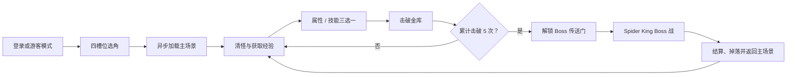
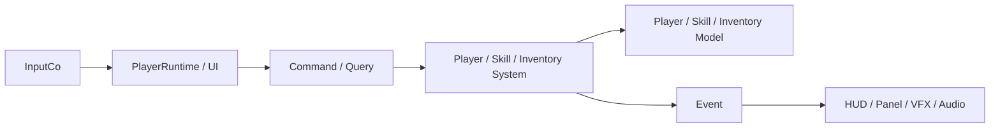
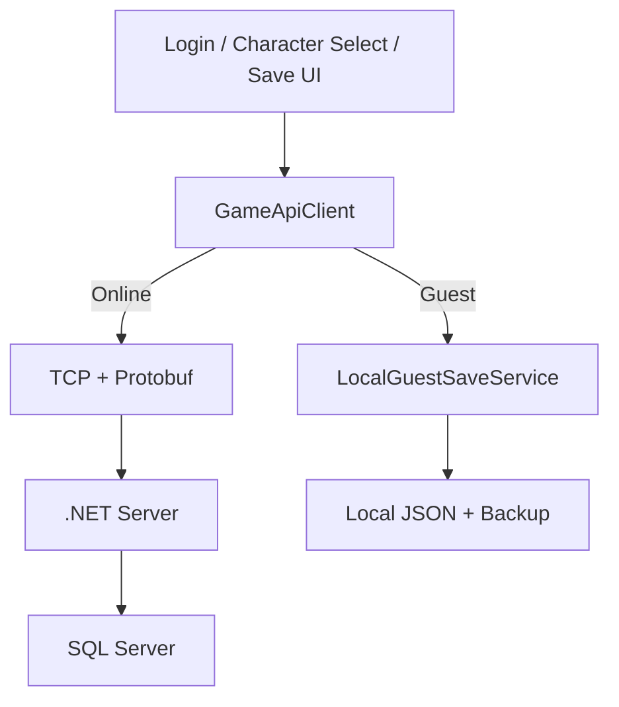

# 金库猎手（Treasure Hunter）

> 面向 Unity 客户端岗位作品集的 3D 动作 Roguelite 原型。
> 项目围绕“四职业战斗、局内成长、金库推进、Boss 周回”构建，并实现了客户端分层、对象池、AI、背包、异步场景加载，以及在线/离线两套角色存档流程。

## 项目定位

《金库猎手》是一款个人持续开发的 Unity 3D 第三人称动作游戏原型。

玩家可以使用战士、法师、弓箭手或刺客进入地牢，在怪物压力下击破金库、获取经验和随机成长。累计击破 5 次金库后会解锁 Boss 传送门；击败 Spider King 后返回主场景继续下一轮，Boss 和怪物会随周回进度成长。

项目主要用于展示以下 Unity 客户端能力：

- 角色移动、动画、碰撞、近战与远程战斗。
- QFramework Model / System / Command / Query / Event 分层。
- JSON、ScriptableObject 与数据库结合的数据驱动设计。
- 怪物 FSM、Boss 行为树与阶段化战斗。
- 技能特效、投射物、怪物、掉落物和飘字对象池。
- uGUI、事件驱动刷新、小地图和异步场景加载。
- TCP + Protobuf 客户端/服务端通信和角色进度持久化。
- Unity Test Framework EditMode 测试与编辑器配置校验。

> 当前状态：可游玩的求职展示原型，仍在持续迭代，并非完整商业游戏。

## 项目信息

| 项目 | 内容 |
| --- | --- |
| 游戏类型 | Unity 3D 第三人称动作 Roguelite |
| 开发方式 | 个人项目 |
| Unity 版本 | 2021.3.45f2c1 |
| 客户端语言 | C# |
| 服务端 | .NET 9 / C# |
| 客户端架构 | QFramework + 组件化 PlayerRuntime |
| 网络与协议 | TCP / Protobuf |
| 数据存储 | JSON / ScriptableObject / SQL Server |
| 资源加载 | Resources + Addressables 第一阶段 |
| UI | Unity uGUI |
| 测试 | Unity Test Framework / NUnit EditMode |

## 游戏流程


```mermaid
flowchart LR
    A["登录或游客模式"] --> B["四槽位选角"]
    B --> C["异步加载主场景"]
    C --> D["清怪与获取经验"]
    D --> E["属性 / 技能三选一"]
    E --> F["击破金库"]
    F --> G{"累计击破 5 次？"}
    G -->|否| D
    G -->|是| H["解锁 Boss 传送门"]
    H --> I["Spider King Boss 战"]
    I --> J["结算、掉落并返回主场景"]
    J --> D
```

局内的主要决策是：

- 清理怪物，降低生存压力并获得经验。
- 寻找安全窗口攻击金库，推进分数与 Boss 流程。
- 在属性强化和技能成长之间选择当前流派。
- 管理生命、魔法和体力，合理使用背包中的恢复物品。
- 根据近战、远程职业特点调整站位和输出方式。

## 快速体验

### 游客模式（推荐）

游客模式不依赖服务端和数据库，适合第一次运行项目。

1. 使用 Unity Hub 打开项目。
2. 使用 Unity `2021.3.45f2c1` 或兼容的 Unity 2021 LTS。
3. 打开：

   ```text
   Assets/Scenes/LoginScene.unity
   ```

4. 点击 Play，打开登录面板并选择“游客模式”。
5. 在四个角色槽中创建或选择角色。
6. 经过 LoadingScene 后进入 MainScene。

游客角色会保存到 `Application.persistentDataPath` 下的本地 JSON。写入采用临时文件替换和备份恢复，退出登录不会删除游客档案。

### 联网模式

联网模式需要：

- .NET 9 SDK
- SQL Server
- 可用的 `Users` 和 `PlayerProfiles` 基础表

配置 `TreasureHunter.Server/appsettings.json` 中的以下内容：

- `Server:Host`
- `Server:Port`
- `Server:Backlog`
- `Server:MessageThreads`
- `ConnectionStrings:TreasureHunterDb`

不要把真实数据库账号、密码或生产环境连接串提交到公开仓库。

启动服务端：

```powershell
dotnet run --project TreasureHunter.Server/TreasureHunter.Server.csproj
```

客户端默认连接 `127.0.0.1:8000`，可在 `GameApiClient` 的 Inspector 配置中调整。

服务端启动时会幂等检查角色进度与属性强化相关表；账号基础表仍需要提前准备。随后可以在 LoginScene 中测试注册、登录、创建角色、进入游戏和保存进度。

## 操作说明

| 操作 | 按键 |
| --- | --- |
| 移动 | `WASD` / 方向键 |
| 镜头 | 鼠标移动 |
| 镜头距离 | 鼠标滚轮 |
| 跑步 | `Left Shift` / `Right Shift` |
| 跳跃 | `Space` |
| 普通攻击 | 鼠标左键 |
| 翻滚 | 鼠标右键 / `Left Alt` |
| 技能 1 / 2 / 3 | `1` / `2` / `3` |
| 范围技能预览 | 按住技能键，松开后释放 |
| 背包 | `B` |
| 属性面板 | `Tab` |
| 暂停 | `Esc` |

Unity 编辑器或 Development Build 中还可以按 `F1` 开启开发者模式：

| 调试操作 | 按键 |
| --- | --- |
| 增加 15 级并跳过属性选择 | `L` |
| 增加 100 经验 | `P` |
| 回满魔法 | `O` |
| 快速击破一次金库 | `N` |

调试入口仍调用正式成长或金库流程，避免直接修改表现数据后绕过业务事件。

## 已实现系统

### 1. 四职业共用玩家运行时

四个职业不再各自复制一套玩家脚本，而是采用：

```text
PlayerRuntime 通用逻辑壳
+ CharacterDefine 职业数据
+ 职业 Visual Prefab / Animator
= 场景中的可玩角色
```

当前职业：

| 职业 | 战斗定位 | 普通攻击 |
| --- | --- | --- |
| 战士 | 高生命、高防御的正面近战 | 武器碰撞窗口 |
| 法师 | 高魔法和范围输出 | 弧线火球与范围爆炸 |
| 弓箭手 | 高机动远程物理输出 | 点击即发射箭矢 |
| 刺客 | 高爆发、高移速连续近战 | 三段连击与旋转攻击 |

`GameplayCharacterSpawner` 负责把通用 `PlayerRuntime` 与职业模型组合；`PlayerRuntimeController` 只负责编排组件，不保存战斗公式。

玩家能力继续拆分为：

- `PlayerMovementComponent`：移动、跑步、跳跃、翻滚和体力。
- `PlayerCombatComponent`：攻击输入、连击令牌和伤害入口。
- `PlayerHealthComponent`：受伤、治疗、死亡与反馈。
- `PlayerProgressionComponent`：经验、升级和成长选择。
- `PlayerPresentationComponent`：Animator 与职业表现。
- `PlayerRangedAttackComponent`：远程普攻和投射物池。
- `PlayerSkillCastComponent`：技能预览、释放和特效表现。

### 2. QFramework 数据与规则分层

客户端使用 QFramework 将“权威数据、业务规则、Unity 表现”分开：


```mermaid
flowchart LR
    A["InputCo"] --> B["PlayerRuntime / UI"]
    B --> C["Command / Query"]
    C --> D["Player / Skill / Inventory System"]
    D --> E["Player / Skill / Inventory Model"]
    D --> F["Event"]
    F --> G["HUD / Panel / VFX / Audio"]
```

主要 Model：

- `PlayerModel`：角色权威属性，并通过只读接口对外暴露。
- `PlayerSkillModel`：已学习技能、等级、冷却和待选择次数。
- `InventoryModel`：24 格运行时背包数据。

主要 System：

- `PlayerResourceSystem`：魔法消耗与恢复。
- `PlayerCombatSystem`：伤害、暴击、闪避、治疗和死亡。
- `PlayerProgressionSystem`：经验、等级和八类属性成长。
- `PlayerSkillSystem`：技能学习、升级、随机候选和释放校验。
- `InventorySystem`：堆叠、移除、满包和物品使用规则。

MonoBehaviour 主要处理输入、动画、物理、场景和 UI，不直接成为权威数据源。

### 3. 战斗与成长

已实现：

- CharacterController 第三人称移动。
- 跑步、跳跃、翻滚和体力消耗/恢复。
- 动画事件驱动的近战攻击窗口。
- 暴击、闪避、减伤、回血、吸血等属性。
- 世界空间伤害、治疗、经验和 miss 飘字。
- 角色等级和随机属性三选一。
- 魔法值、技能冷却、技能学习与升级。
- 玩家死亡、暂停、结算和场景返回。

统一的 `FighterInterface` 让玩家、怪物、金库和 Boss 共享受击入口。攻击方只负责命中与传入伤害，受击对象自行处理扣血、死亡、奖励和反馈。

### 4. 数据驱动技能

技能静态配置位于：

```text
Assets/Resources/Data/SkillDefine.json
```

当前实现 3 个技能：

| 技能 | 类型 | 特点 |
| --- | --- | --- |
| 大火球 | ProjectileAoe | 投射物命中后造成范围伤害 |
| 毒雾领域 | AreaDot | 持续伤害并降低怪物移动速度 |
| 镰刀大旋转 | SelfAoe | 刺客专属近身范围攻击 |

当前运行时配置为每个技能 4 级，等级数据包含蓝耗、冷却、伤害倍率、半径、持续时间、跳伤间隔和减速比例。

技能释放流程：

```text
技能输入
-> PlayerSkillCastComponent
-> TryCastPlayerSkillCommand
-> PlayerSkillSystem 校验职业 / 等级 / 蓝耗 / 冷却
-> PlayerSkillModel 更新状态
-> 技能表现与范围伤害
-> SkillVisualPool 回收特效
```

技能支持按住按键显示范围预览、松手释放。技能 Prefab 特效通过 Addressables 本地异步加载，并在释放加载句柄前先清理对应对象池实例。

### 5. 近战与远程攻击

近战通过动画事件控制武器碰撞窗口，同一目标在一个攻击窗口内只结算一次伤害。

远程普攻使用可复用投射物池：

- 法师火球使用弧线轨迹和范围爆炸。
- 弓箭手每次左键按下都会创建独立攻击令牌并立即发射。
- 高速箭矢在 `FixedUpdate` 中使用 `SphereCastNonAlloc` 检测完整移动路径。
- 投射物回池时重置计时、拥有者、碰撞、刚体、Renderer、粒子和 Trail 等状态。

这种实现避免依赖第三方 Prefab 中复杂的 Trigger 层级，也降低了高速投射物穿透和对象状态残留的风险。

### 6. 怪物 FSM、刷怪与对象池

普通怪物使用枚举状态机管理：

```text
Idle -> Patrol -> Pursuit -> Attack -> Die
```

已实现近战/远程怪、巡逻、索敌、攻击冷却、受击反馈、经验奖励和难度成长。

`MonsSpawner` 与 `MonsterManager` 控制区域刷怪；`MonsterPool` 负责怪物获取和回收。回收时会清理协程、事件、受击状态和运行时引用，避免对象池复用后继承上一条生命的数据。

### 7. Spider King Boss 行为树

Boss 使用轻量行为树组织决策：

- Selector：选择当前可执行行为。
- Sequence：组合条件与动作。
- Condition：检测距离、冷却和阶段。
- Action：执行分离、近战、法术、追击或待机。

Spider King 支持：

- 近战撕咬和爪击。
- 远程紫色投射物。
- 追击与近身防重叠。
- 35% 生命以下进入狂暴阶段。
- 狂暴阶段提高移速与伤害，并缩短技能冷却。
- Boss 血条、阶段名称、死亡结算和专属掉落。
- 根据完成周回数提高生命、攻击和行动频率。

Boss 死亡后会生成返回传送门，并保留同一局中的玩家属性与金库进度。

### 8. 背包、掉落与拾取

背包使用 ScriptableObject 保存物品静态定义，QFramework Model 保存运行时格子数据，UI 只监听事件刷新。

已实现：

- 24 个固定格子。
- 同类物品优先堆叠。
- 超过单格上限后占用下一个空格。
- 满包和部分拾取反馈。
- 生命药水、魔法药水等消耗品。
- 普通怪概率掉落与 Boss 独立权重掉落表。
- 世界拾取物与 Boss 发光掉落球。
- 掉落物对象池、超时回收和回收状态重置。

当前背包属于单次角色会话数据，尚未写入在线数据库或游客存档。

### 9. UI、小地图与场景流程

主要 UI 统一放在 `GameplayUiRoot.prefab`：

- 生命、魔法、体力和经验 HUD。
- 技能栏、技能释放提示。
- 属性成长与技能三选一。
- 角色属性面板。
- 24 格背包与物品详情。
- 小地图、玩家图标和目标图标。
- 开局说明、暂停和游戏结束界面。
- Boss 血条与战斗状态。

数据变化通过事件触发 UI 刷新，不依赖每帧无条件重建内容。

场景流程：

| 场景 | 职责 |
| --- | --- |
| LoginScene | 登录、注册和游客入口 |
| CharacterSelectScene | 四角色槽、职业预览和创建角色 |
| LoadingScene | 异步加载与真实进度显示 |
| MainScene | 主玩法、怪物、金库和成长 |
| BossRoomScene | Spider King Boss 战 |

`SceneFlowService` 统一负责跳转前恢复 TimeScale、清理会话状态和防止重复加载；`LoadingSceneController` 将 Unity 的 0～0.9 加载区间换算为 UI 的 0%～100%，并使用未缩放时间刷新进度。

小地图使用独立摄像机与 RenderTexture，并通过降低刷新频率、关闭不必要 MSAA 等配置控制开销。

### 10. 在线账号与离线游客存档

上层 UI 只调用 `GameApiClient`，不需要分别维护在线版和游客版选角流程：


```mermaid
flowchart TD
    A["Login / Character Select / Save UI"] --> B["GameApiClient"]
    B -->|Online| C["TCP + Protobuf"]
    C --> D[".NET Server"]
    D --> E["SQL Server"]
    B -->|Guest| F["LocalGuestSaveService"]
    F --> G["Local JSON + Backup"]
```

联网模式支持：

- 注册与登录。
- BCrypt 加盐哈希验证密码。
- 四个角色槽。
- 创建角色与进入/离开游戏。
- 等级、经验、待选属性点、八类强化次数、金库数和 Boss 数存档。
- Session 绑定角色，避免客户端指定并修改其他账号角色。
- 服务端校验进度范围、倒退覆盖和强化次数合法性。
- SQL 参数化查询与事务写入。

游客模式支持同一套角色选择和成长流程：

- 使用带版本号的本地 JSON。
- 正式文件写入前先生成临时文件。
- 主文件损坏时尝试从有效备份恢复。
- 写盘成功后才提交内存状态，避免“界面显示成功但重启后丢档”。
- 游客数据与在线账号会话隔离。

## 配置入口

| 配置 | 路径 |
| --- | --- |
| 职业配置 | `Assets/Resources/Data/CharacterDefine.json` |
| 技能配置 | `Assets/Resources/Data/SkillDefine.json` |
| 背包数据库 | `Assets/Resources/Data/Inventory/InventoryDatabase.asset` |
| 物品配置 | `Assets/Resources/Data/Inventory/*.asset` |
| 核心玩法数值 | `Assets/Script/Core/GameConfig.cs` 与场景 Inspector |
| Addressables | `Assets/AddressableAssetsData` |
| 服务端配置 | `TreasureHunter.Server/appsettings.json` |

职业数据与表现 Prefab 分离，技能通过 JSON 校验后进入运行时字典，物品静态数据与玩家拥有数量分离。这样新增职业、技能或物品时，可以尽量减少对核心流程的修改。

## 核心目录

```text
Treasure-Hunter/
├── Assets/
│   ├── Editor/                         # 配置迁移工具、架构校验与 EditMode 测试
│   ├── Prefabs/                        # 玩法、UI、世界物体 Prefab
│   ├── Resources/
│   │   ├── Characters/                 # 通用 PlayerRuntime 与职业表现 Prefab
│   │   └── Data/                       # 职业、技能、背包与物品配置
│   ├── Scenes/                         # 5 个构建场景
│   ├── Script/
│   │   ├── Architecture/               # Model、System、Command、Query、Event
│   │   ├── Boss/                       # Boss 行为树、流程与 HUD
│   │   ├── Camera/                     # 主镜头与小地图摄像机
│   │   ├── Combat/                     # 受击接口、投射物、武器和飘字
│   │   ├── Core/                       # 全局配置、运行时上下文与场景名
│   │   ├── Data/                       # 职业、技能和背包配置读取
│   │   ├── Enemies/                    # FSM、刷怪与怪物对象池
│   │   ├── Input/                      # 输入接口与帧缓存
│   │   ├── Network/                    # TCP 客户端、封包与消息分发
│   │   ├── Player/                     # 通用玩家组件和职业生成
│   │   ├── Services/                   # API、存档、场景和资源服务
│   │   ├── Skills/                     # 技能释放、持续区域和特效池
│   │   ├── UI/                         # HUD、选角、背包、小地图等界面
│   │   └── World/                      # 金库、掉落与世界拾取
│   └── ThirdParty/QFramework/          # 项目使用的轻量客户端架构
├── Docs/
│   └── ProjectLearningNotes.md         # 功能实现、测试和面试复习记录
├── ProjectSettings/
├── Packages/
└── TreasureHunter.Server/
    ├── Network/                        # TCP 连接、会话、封包与分发
    ├── Services/                       # 用户业务与 SQL Server 数据访问
    ├── Entities/                       # 在线角色实体
    └── Protocols/                      # Protobuf 消息结构
```

## 关键调用链

### 玩家战斗

```text
InputCo
-> PlayerRuntimeController
-> PlayerCombatComponent
-> RollPlayerAttackCommand
-> PlayerCombatSystem
-> FighterInterface.Hit
-> 受击对象结算
-> QFramework Event
-> HUD / 飘字 / 音效
```

### 角色存档

```text
玩家成长事件
-> CharacterProgressSaveService
-> GameApiClient
-> 在线：TCP / Protobuf -> UserService -> DBService -> SQL Server
-> 游客：LocalGuestSaveService -> 临时 JSON -> 正式文件 / 备份
```

### Boss 周回

```text
BoxCo.OnVaultDestroyed
-> BossRunProgressState
-> BossPortalUnlockController
-> BossScenePortal
-> SceneFlowService
-> BossRoomScene
-> SpiderKingBossController
-> Boss 胜利结算
-> 返回 MainScene 并恢复本局状态
```

## 性能与稳定性处理

- 输入每帧统一采样，其他模块通过 `IGameplayInput` 读取缓存。
- 通过 `GameplayRuntime` 保存当前玩家、金库和输入引用，减少频繁场景查找。
- 怪物、世界掉落、技能特效、投射物和战斗飘字采用对象池。
- 高速投射物使用 NonAlloc 物理查询，减少分配并降低穿透风险。
- UI 通过事件刷新，不每帧重建格子或属性列表。
- 小地图摄像机降低刷新频率并使用专用 RenderTexture。
- 网络收包线程与 Unity 主线程表现分离，主线程统一消费消息。
- 对象回池时显式重置事件、协程、碰撞、特效和业务状态。
- Addressables 释放句柄前先清理仍依赖资源的池化实例。
- 场景跳转统一恢复 `Time.timeScale`，防止暂停状态污染新场景。

## 测试与编辑器工具

`Assets/Editor/Tests` 中包含针对以下内容的 EditMode 测试：

- PlayerModel 只读约束、伤害、治疗、升级和事件。
- 四职业配置、Animator、Prefab 和基础可玩性。
- 远程投射物命中、出生重叠、寿命与对象池回收。
- 背包堆叠、满包、物品使用、掉落和 UI 格子配置。
- 游客 JSON 往返、备份恢复和写盘失败。
- 在线角色成长字段和跨场景状态传递。
- LoadingScene、GameplayUiRoot、小地图和鼠标状态配置。
- 技能配置校验与 Addressables 分组配置。

项目还包含职业 Animator 修复、Gameplay UI 迁移、Boss 房间搭建、背包配置生成和架构校验等 Editor 工具，用于把重复的场景/Prefab 配置步骤固化为可验证流程。

## 当前边界与已知不足

- 当前是单人客户端原型，联网部分主要负责账号、角色槽和进度存档，不包含多人位置或战斗同步。
- 在线存档与游客存档暂不保存背包、当前血蓝、场景对象和动画状态。
- Addressables 当前用于本地技能特效加载，尚未实现远程资源更新、下载和版本管理。
- 新版组件化 `PlayerRuntime` 已成为主要玩家流程，但项目仍保留部分旧 `PlayerCo` 兼容代码，后续需要继续收敛。
- 项目正在同步 v3.0 数值平衡，资源、Prefab 与回归断言需要在每次数值调整后一起复核。
- 数据库会自动检查角色相关表，但账号基础表尚未提供独立的版本化迁移脚本。
- 项目尚未接入 CI、自动构建、性能基准和真机兼容性矩阵。

## 后续计划

按 Unity 客户端求职价值，后续优先级为：

1. 完成 v3.0 数值配置、Prefab 与回归测试的全量一致性验证。
2. 将遗留玩家逻辑继续迁移到组件化 PlayerRuntime。
3. 增加装备系统，并与背包和角色属性计算解耦。
4. 保存背包与装备数据，补充数据库版本迁移。
5. 扩充职业专属技能、技能组合和更完整的对象池统计。
6. 增加配置表导入校验、运行时日志分级和存档版本升级。
7. 使用 Profiler 验证战斗高峰、UI、小地图和对象池的实际开销。
8. 建立自动测试与构建流程。
9. 在单机体验稳定后，再扩展服务端校验、多人同步和网络延迟处理。

## 项目设计取舍

这个项目不是一次性写出的完整框架，而是在可玩原型基础上逐步增加系统并迁移架构。因此目前同时存在“已经组件化的主流程”和“仍待清理的兼容逻辑”。

我在迭代中主要遵循：

- 数据层不直接操作 Unity 表现。
- UI 不直接修改 Model。
- 输入、规则、表现和持久化尽量拆开。
- 高频创建对象优先考虑对象池，并明确回收重置。
- 调试入口复用正式业务流程。
- 服务端不直接信任客户端提交的角色身份与成长数据。
- 先完成可验证的小版本，再逐步替换历史代码。

这些取舍让项目既能保持可运行，也能逐步向更适合扩展和面试讲解的结构演进。

## 资源说明

项目中的部分模型、动画、特效、音效和 GUI 资源来自学习资源包，用于个人学习和求职作品展示。核心客户端逻辑、服务端逻辑、系统整合、配置、测试和文档由项目开发者完成。

如需公开发布或商业使用，请先重新核对所有第三方资源的授权范围。
