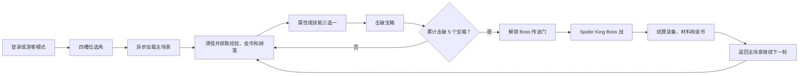
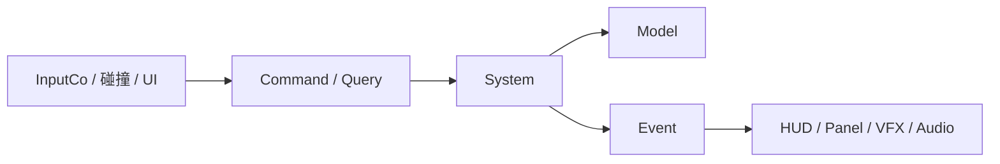
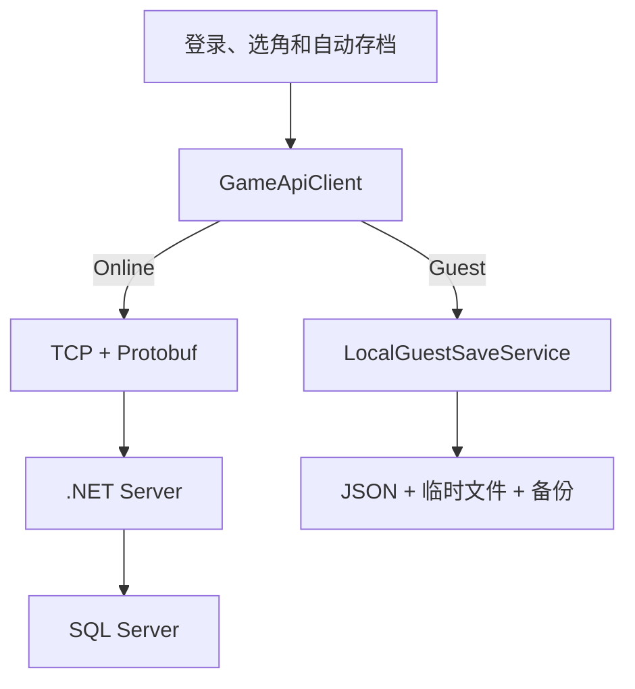

# 宝藏猎手

> 面向 Unity 客户端岗位作品集的 3D 第三人称动作 Roguelite 原型。
> 项目围绕“四职业战斗、局内成长、宝箱推进、Boss 周回”构建，重点展示玩法系统拆分、数据驱动、对象池、事件驱动 UI、客户端/服务端联调和可验证的工程实践。

## 项目定位

《宝藏猎手》是一个个人持续开发的 Unity 3D 动作游戏项目。

玩家可以选择战士、法师、弓箭手或刺客进入地牢，在怪物压力下清理敌人、击破宝箱并获得成长。累计击破 5 个宝箱后会解锁 Boss 传送门；击败 Spider King 后返回主场景继续下一轮，怪物、宝箱和 Boss 会按照周回进度进行线性成长。

当前版本已经形成可游玩的单人闭环，并继续围绕求职展示补充工程质量、系统深度和验证材料。它不是完整商业游戏，也不包含实时多人战斗同步。

## 项目信息

| 项目 | 内容 |
| --- | --- |
| 游戏名称 | 宝藏猎手 |
| 游戏类型 | 3D 第三人称动作 Roguelite |
| 开发方式 | 个人项目 |
| Unity 版本 | 2021.3.45f2c1 |
| 客户端语言 | C# |
| 客户端架构 | QFramework + 组件化 PlayerRuntime |
| 服务端 | .NET 9 / C# |
| 网络协议 | TCP / Protobuf |
| 数据存储 | JSON / ScriptableObject / SQL Server |
| 资源加载 | Resources + Addressables 本地异步加载 |
| UI | Unity uGUI |
| 测试 | Unity Test Framework / NUnit EditMode |

## 核心玩法循环


```mermaid
flowchart LR
    A["登录或游客模式"] --> B["四槽位选角"]
    B --> C["异步加载主场景"]
    C --> D["清怪并获取经验、金币和掉落"]
    D --> E["属性或技能三选一"]
    E --> F["击破宝箱"]
    F --> G{"累计击破 5 个宝箱？"}
    G -->|否| D
    G -->|是| H["解锁 Boss 传送门"]
    H --> I["Spider King Boss 战"]
    I --> J["结算装备、材料和金币"]
    J --> K["返回主场景继续下一轮"]
    K --> D
```

玩家在一局中需要同时处理几种选择：

- 清理怪物，降低生存压力并获得经验、金币和随机掉落。
- 寻找安全窗口攻击宝箱，推进 Boss 解锁进度。
- 在属性强化与技能成长之间选择当前 Build。
- 管理生命、魔法和体力，并使用背包中的恢复物品。
- 穿戴不同部位的装备，通过固定属性调整角色能力。
- 与 Fungi 商人和 Mushroom 任务 NPC 交互，获得补给和长期进度。

## 快速体验

### 游客模式（推荐）

游客模式不依赖服务端和数据库，适合第一次运行项目。

1. 使用 Unity Hub 打开项目。
2. 使用 Unity `2021.3.45f2c1` 或兼容的 Unity 2021 LTS。
3. 打开 `Assets/Scenes/LoginScene.unity`。
4. 点击 Play，打开登录面板并选择“游客模式”。
5. 在四个角色槽中创建或选择角色。
6. 经过 LoadingScene 后进入 MainScene。

游客数据保存在 `Application.persistentDataPath/Saves/guest-save.json`。当前存档版本为 v5，写入时会先生成临时文件，并保留备份用于损坏恢复。

### 联网模式

联网模式需要：

- .NET 9 SDK。
- SQL Server。
- 可用的账号基础表与角色进度相关表。

在 `TreasureHunter.Server/appsettings.json` 中配置服务端监听地址和数据库连接。不要把真实账号、密码或生产环境连接串提交到公开仓库。

启动服务端：

```powershell
dotnet run --project TreasureHunter.Server/TreasureHunter.Server.csproj
```

客户端默认连接 `127.0.0.1:8000`，可在 `GameApiClient` 的 Inspector 配置中调整。

当前联网范围包括注册、登录、四角色槽和角色长期进度持久化，不包含多人位置、技能或战斗同步。

## 操作说明

| 操作 | 按键 |
| --- | --- |
| 移动 | `WASD` / 方向键 |
| 镜头 | 鼠标移动 |
| 镜头距离 | 鼠标滚轮 |
| 奔跑 | `Left Shift` / `Right Shift` |
| 跳跃 | `Space` |
| 普通攻击 | 鼠标左键 |
| 翻滚 | 鼠标右键 / `Left Alt` |
| 技能 1 / 2 / 3 | `1` / `2` / `3` |
| 背包与装备 | `B` |
| 角色属性 | `Tab` |
| 大地图 | `M` |
| NPC 交互 | `E` |
| 暂停或关闭当前模态窗口 | `Esc` |

技能支持按住按键显示范围预览、松开释放。战士长按左键可以蓄力，蓄满后释放 360 度范围重斩。

### 开发者模式

Unity Editor、Development Build 和当前 Windows 演示包中可以按 `F1` 打开开发者模式：

| 按键 | 功能 |
| --- | --- |
| `F1` | 开关开发者模式并显示调试面板 |
| `F2` | 开关极高攻击 |
| `F3` | 开关无敌 |
| `F4` | 增加 10,000 金币 |
| `F5` | 补足当前 Boss 周期剩余宝箱 |
| `F6` | 增加 1 级并跳过本次属性选择 |
| `F7` | 回满魔法 |
| `F8` | 开关技能零冷却 |

调试入口尽量复用正式 Command、System 和奖励流程；关闭开发者模式时会清除高攻、无敌和零冷却等临时状态。

## 已实现系统

### 1. 四职业共用玩家运行时

四个职业采用同一套组件化逻辑壳：

```text
PlayerRuntime 通用逻辑
+ CharacterDefine 职业配置
+ 职业 Visual Prefab / Animator
= 场景中的可玩角色
```

| 职业 | 当前定位 | 代表机制 |
| --- | --- | --- |
| 战士 | 高容错近战 | 1.6 秒蓄力、最高 3 倍伤害、满蓄力减伤与 360 度重斩 |
| 法师 | 脆弱的远程范围输出 | 弧线火球、范围爆炸和较高魔法值 |
| 弓箭手 | 高频远程持续输出 | 0.25 秒射击间隔、高速箭矢与完整路径检测 |
| 刺客 | 高风险高爆发近战 | 连击、较低生存、专属镰刀技能与动作承诺 |

玩家职责拆分为：

- `PlayerMovementComponent`：移动、奔跑、跳跃、翻滚和体力。
- `PlayerCombatComponent`：攻击输入、连击、攻击令牌和伤害入口。
- `PlayerHealthComponent`：受伤、治疗、死亡与材质反馈。
- `PlayerProgressionComponent`：经验、升级和成长选择。
- `PlayerPresentationComponent`：Animator 与职业表现。
- `PlayerRangedAttackComponent`：远程普攻和投射物池。
- `PlayerChargedAttackComponent`：战士蓄力状态机。
- `PlayerSkillCastComponent`：技能预览、释放、动作承诺和特效表现。
- `PlayerAudioComponent`：玩家动作音效。

`PlayerRuntimeController` 负责编排这些组件，不保存另一套战斗数值。

### 2. QFramework 玩法分层

客户端通过 Model、System、Command、Query 和 Event 分离权威数据、业务规则与 Unity 表现：


```mermaid
flowchart LR
    A["InputCo / 碰撞 / UI"] --> B["Command / Query"]
    B --> C["System"]
    C --> D["Model"]
    C --> E["Event"]
    E --> F["HUD / Panel / VFX / Audio"]
```

当前 Architecture 注册了 8 个 Model：玩家、技能、开发者模式、背包、装备、金币经济、商店和任务。

当前注册了 10 个 System，分别负责开发者模式、玩家资源、战斗、技能、成长、背包、装备、经济、商店和任务规则。

MonoBehaviour 只负责输入、物理、动画、场景和 UI，不直接成为长期数据的权威来源。

### 3. 战斗、成长与技能

已实现：

- CharacterController 第三人称移动。
- 奔跑、跳跃、翻滚和体力消耗/恢复。
- 动画事件或受控延迟驱动的近战伤害窗口。
- 暴击、闪避、减伤、再生、吸血和临时减伤。
- 世界空间伤害、治疗、经验和 Miss 飘字。
- 20 级成长上限与八类属性三选一。
- 5、10、15、20 级技能选择。
- 玩家死亡、暂停、结算、保存和场景返回。

技能配置位于 `Assets/Resources/Data/SkillDefine.json`。当前有三项四级技能：

| 技能 | 类型 | 特点 |
| --- | --- | --- |
| 大火球 | ProjectileAoe | 投射物命中后造成范围爆炸 |
| 毒雾领域 | AreaDot | 持续伤害并降低怪物移动速度 |
| 镰刀大旋转 | SelfAoe | 刺客专属，带前摇和动作占用的近身范围攻击 |

技能释放流程：

```text
技能输入
-> PlayerSkillCastComponent
-> TryCastPlayerSkillCommand
-> PlayerSkillSystem 校验职业、等级、蓝耗和冷却
-> PlayerSkillModel 更新权威状态
-> 表现组件执行预览、动画、伤害和特效
-> SkillVisualPool 回收表现对象
```

技能特效通过 Addressables 本地异步加载；释放加载句柄前会先清理仍依赖资源的池化实例。

### 4. 怪物 FSM、Boss 行为树与周回

普通怪物使用枚举状态机：

```text
Idle -> Patrol -> Pursuit -> Attack -> Die
```

怪物支持近战/远程类型、巡逻、索敌、攻击冷却、受击反馈、任务击杀上报、经验与金币奖励。怪物生命、攻击和经验根据已击破宝箱数与已击败 Boss 数进行线性成长。

Spider King 使用轻量行为树组织普通攻击、远程法术、追击和待机决策。35% 生命以下进入狂暴阶段，提高移速和伤害并缩短冷却。Boss 还包含血条、阶段名、受击节流、摄像机遮挡处理、死亡结算、装备/材料/金币掉落和返回传送门。

每击破 5 个宝箱解锁一次 Boss 入口；完成 Boss 后保留同一角色会话并继续下一轮。

### 5. 对象池与性能边界

项目已在以下对象上使用池化：普通怪物、玩家远程投射物、技能特效、战士重斩圆环、世界物品、金币拾取物和战斗飘字。

回收时会重置拥有者、位置、计时、协程、事件、碰撞、Renderer、粒子、Trail 和业务状态，避免复用对象继承上一条生命周期的数据。

高速箭矢使用 `SphereCastNonAlloc` 检测完整移动路径；范围攻击使用非分配物理查询并通过 `HashSet<FighterInterface>` 对多 Collider 目标去重。

当前尚未完成正式 Profiler 基准，因此 README 和简历不声明未经测量的 FPS、GC 或内存优化幅度。

### 6. 背包、装备与掉落

背包将物品静态定义、运行时格子和存档 DTO 分开：

```text
InventoryItemDefinition ScriptableObject
-> InventoryModel 24 格运行时数据
-> InventorySystem 业务规则
-> InventoryChangedEvent
-> InventoryPanel / 自动存档
```

已实现：

- 24 个固定背包格与堆叠、溢出、满包、部分拾取反馈。
- 生命药水、魔法药水、材料、任务物品和装备分类。
- 普通怪、宝箱和 Boss 的独立掉落规则。
- 掉落物与金币对象池、超时回收和安全生成位置。
- 6 个装备槽：武器、护甲、盾牌、手套、鞋和戒指。
- 背包与装备的原子交换；背包满时禁止卸装。
- 10 级解锁戒指槽。
- 每次从整套装备重新计算属性汇总，再应用新旧差值，避免反复穿脱造成数值漂移。

装备可以提供攻击、最大生命、最大魔法、移动速度、暴击、闪避、减伤和吸血等固定属性。

### 7. 金币、Fungi 商店与 Mushroom 任务

经济系统以 `long` 保存角色金币。Slime、宝箱和 Boss 会生成不同额度的世界金币，拾取后通过 `AddGoldCommand` 修改权威数据并刷新 HUD。

Fungi 商店提供药水、材料以及多个部位的装备。购买前检查商品、角色限购、金币和背包容量；全部预检通过后才扣款并写入背包，意外失败会执行退款保护。

Mushroom 任务系统目前包含两项击杀任务：

- 击杀 5 只红色史莱姆，奖励 50 金币。
- 击杀 8 只绿色史莱姆，奖励 80 金币。

任务状态包括可接取、进行中、可领取和已领取。怪物只上报正式死亡事件；`QuestSystem` 负责过滤目标、推进计数和奖励边界，UI 只发送命令并读取快照。

### 8. UI、设置、音频与场景流程

主要玩法 UI 统一放在 `GameplayUiRoot.prefab`，包含资源 HUD、技能栏、成长选择、属性、背包、装备、商店、任务、小地图、大地图、暂停、失败界面和 Boss 状态。

UI 通过 Query 读取不可变快照，通过 Event 响应数据变化，不每帧重建列表。背包、商店、任务和暂停界面使用统一模态互斥与鼠标状态恢复逻辑。

PC 设置面板支持主/音乐/音效音量、鼠标灵敏度、分辨率、窗口模式、六档画质、VSync 和帧率上限，并提供草稿、取消和显示设置 10 秒安全回退。

`GameAudioService` 根据场景切换音乐并执行淡入淡出；统一音频目录覆盖 UI、玩家、怪物、Boss、任务、商店和拾取反馈。

| 场景 | 职责 |
| --- | --- |
| LoadingScene | 首次启动兜底与异步加载进度 |
| LoginScene | 登录、注册、游客入口和设置 |
| CharacterSelectScene | 四角色槽、职业预览和创建角色 |
| MainScene | 主玩法、怪物、宝箱、商店、任务和成长 |
| BossRoomScene | Spider King Boss 战 |

### 9. 在线账号与离线游客存档

UI 统一通过 `GameApiClient` 访问在线或游客数据源：


```mermaid
flowchart TD
    A["登录、选角和自动存档"] --> B["GameApiClient"]
    B -->|Online| C["TCP + Protobuf"]
    C --> D[".NET Server"]
    D --> E["SQL Server"]
    B -->|Guest| F["LocalGuestSaveService"]
    F --> G["JSON + 临时文件 + 备份"]
```

角色长期数据包括等级、经验、属性强化、宝箱/Boss 进度、背包、装备、金币、商人对话、限购和任务进度。

连续变化通过事件进入 1 秒防抖保存；领奖、接任务、死亡和主动退出等关键节点使用立即保存。在线端把角色成长、背包、装备、商店和任务放入事务，并校验角色身份、稳定 ID、格子边界、堆叠上限、装备槽和任务状态。

死亡时会重置等级、经验、属性强化和关卡累计，清除消耗品，保留材料、任务物品、装备、金币、商店和任务进度；数据源确认后才恢复客户端权威状态。

### 10. UI 资源管线与编辑器工具

项目包含购买 PSD 到运行时 Sprite 的可复现管线：49 个 PSD 通过显式清单导出，当前目录记录 1,015 个清单项和 931 个不重复 Sprite。导出工具过滤示例文字，并由限定目录的 AssetPostprocessor 应用 Sprite、透明通道和九宫格配置。

项目还包含职业 Animator 修复、Boss 房间生成、UI 迁移、设置/背包/商店/任务配置生成、资源校验和专项测试菜单等 Editor 工具。

## 核心配置入口

| 配置 | 路径 |
| --- | --- |
| 职业配置 | `Assets/Resources/Data/CharacterDefine.json` |
| 技能配置 | `Assets/Resources/Data/SkillDefine.json` |
| 物品与装备 | `Assets/Resources/Data/Inventory/*.asset` |
| 背包数据库 | `Assets/Resources/Data/Inventory/InventoryDatabase.asset` |
| 商店目录 | `Assets/Resources/Data/Shop/ShopCatalog.asset` |
| 经济数值 | `Assets/Resources/Data/Shop/EconomyConfig.asset` |
| 任务目录 | `Assets/Resources/Data/Quest/QuestCatalog.asset` |
| 音频目录 | `Assets/Resources/Data/GameAudioCatalog.asset` |
| PC 设置 | `Assets/Resources/Data/GameSettingsConfig.asset` |
| 核心成长与怪物公式 | `Assets/Script/Core/GameConfig.cs` 与场景 Inspector |
| Addressables | `Assets/AddressableAssetsData` |
| 服务端配置 | `TreasureHunter.Server/appsettings.json` |

## 关键调用链

### 装备穿戴

```text
InventoryPanel
-> EquipInventoryItemCommand
-> EquipmentSystem
-> InventorySystem 原子交换
-> EquipmentModel
-> 重算整套装备属性差值
-> EquipmentChangedEvent / PlayerStatsChangedEvent
-> UI 与自动存档
```

### 商店购买

```text
MerchantShopPanel
-> PurchaseShopItemCommand
-> ShopSystem
-> 限购、金币和容量预检
-> EconomySystem 扣款
-> InventorySystem 入包
-> 失败退款保护 / 成功事件
-> UI 与自动存档
```

### 任务进度

```text
怪物正式死亡
-> MonsterQuestProgressReporter
-> RecordMonsterDefeatedCommand
-> QuestSystem
-> QuestModel
-> QuestProgressChangedEvent
-> QuestPanel / CharacterProgressSaveService
```

### 角色存档

```text
成长、背包、装备、金币、商店或任务事件
-> CharacterProgressSaveService
-> 立即保存或 1 秒防抖合并
-> GetPlayerProgressSaveDataQuery
-> GameApiClient
-> 在线：TCP / Protobuf -> UserService -> DBService -> SQL Server 事务
-> 游客：LocalGuestSaveService -> 临时 JSON -> 正式文件 / 备份
-> 数据源返回权威角色快照
-> 恢复 Model 与 UI
```

## 测试与验证

`Assets/Editor/Tests` 当前包含 27 个 EditMode 测试脚本，覆盖玩家、职业机制、技能、背包、装备、商店、任务、存档、设置、音频、场景和 UI 资产边界。

仓库当前没有保存最近一次完整测试结果，因此文档只陈述测试代码的存在和覆盖范围，不声明未经本机重新执行的通过率。

## 当前边界与已知不足

- 当前是单人游戏；在线模块用于账号、角色槽和持久化，不包含实时多人同步。
- Addressables 当前只用于本地技能特效，尚未实现远程资源更新和版本管理。
- `PlayerRuntime` 已成为主要玩家流程，但仍保留部分旧 `PlayerCo` 兼容代码。
- 当前缺少 CI、自动构建、正式测试报告和真机兼容性矩阵。
- 尚未形成可公开引用的 Profiler、GC、内存和 FPS 基准数据。
- 商店和任务属于可运行的最小闭环，内容数量仍有限。
- 第三方素材用于学习与求职展示；公开发布或商业使用前必须重新核对授权。

## 后续计划

1. 在目标 Unity 版本重新执行完整 EditMode 测试并保存真实结果。
2. 使用 Profiler 建立战斗高峰、对象池、UI 和小地图的性能基线。
3. 继续收敛旧 `PlayerCo` 兼容逻辑。
4. 增加职业专属技能、装备组合、任务和商店内容。
5. 完善存档与数据库版本迁移。
6. 建立自动构建和基础 CI。
7. 单机闭环稳定后再评估多人同步。

## 求职展示重点

1. 将原型逐步迁移成 Model/System/Command/Query/Event 与 MonoBehaviour 组件协作的结构。
2. 使用 JSON、ScriptableObject 和稳定 ID 分离静态配置、运行时数据与持久化 DTO。
3. 使用对象池、非分配物理查询、事件驱动 UI 和异步资源/场景流程处理生命周期问题。
4. 让游客 JSON 与在线 SQL Server 复用同一套角色规则，并在服务端校验身份和数据边界。
5. 使用 Editor 工具与 EditMode 测试保护 Prefab、配置和业务规则。

可直接使用的简历版本与面试表达见 `Docs/ResumeProjectDescription.md`，文档版本关系见 `Docs/README.md`。

## 资源说明

历史策划案只记录方案演进，不能作为当前已实现功能的证明。项目中的部分模型、动画、特效、音效和 GUI 资源来自学习资源包；核心客户端逻辑、服务端逻辑、系统整合、配置、测试和项目文档由开发者完成。
